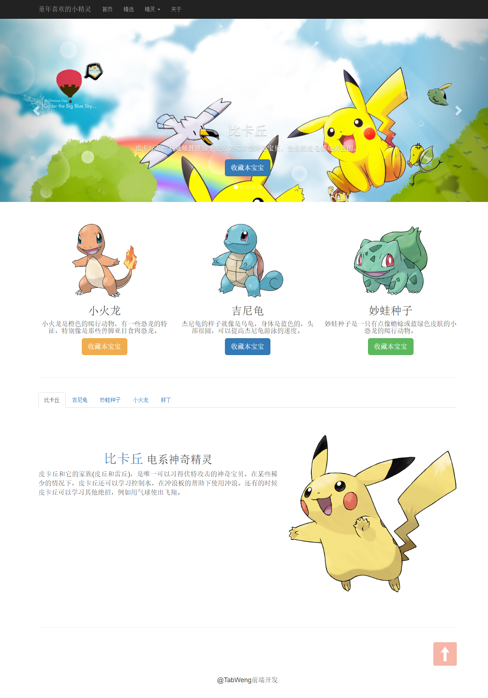
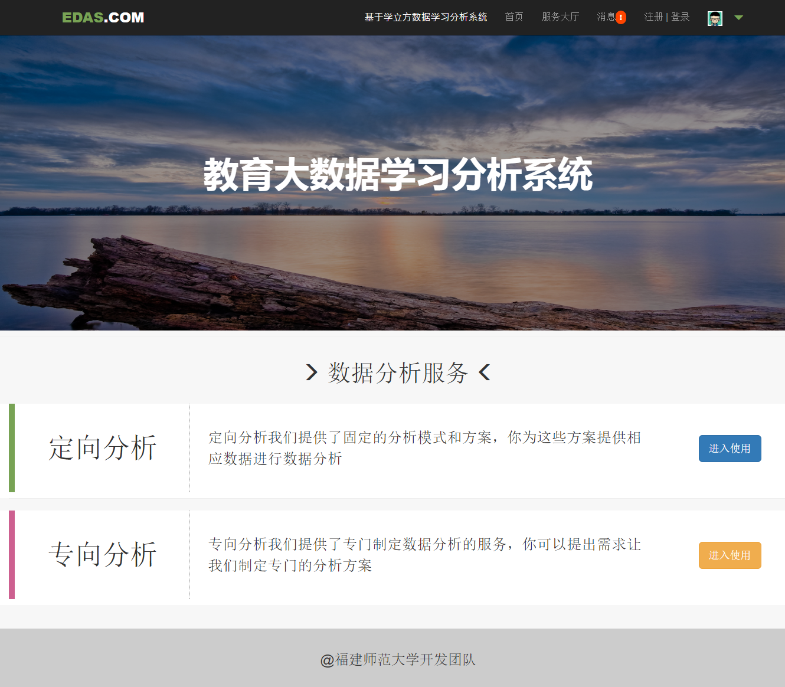

Presentation of works
=====================
###提示：
1. 下列网页都为个人独立设计完成，支持响应式
2. github图片加载比较缓慢，可以点击下列链接查看作品

###各个作品的效果的链接地址：
 
+ <a href="https://tabweng.github.io/zkyt-index/index.html" target="_blank">深圳市中科研拓  [点击进入]</a>
 
+ <a href="https://tabweng.github.io/Bootstrap_smallDemo/index.html" target="_blank">小精灵  [点击进入]</a>
 
+ <a href="https://tabweng.github.io/sanMao/index.html" target="_blank">纪念文人-走进三毛  [点击进入]</a>
 
+ <a href="http://tabweng.github.io/EAS_UI/index.html" target="_blank">用bootstrap实现的数据分析系统  [点击进入]</a>

###<a href="https://tabweng.github.io/zkyt-index/index.html" target="_blank">中科研拓首页</a>###

###<a href="https://tabweng.github.io/Bootstrap_smallDemo/index.html" target="_blank">小精灵</a>###

 
###<a href="https://tabweng.github.io/sanMao/index.html" target="_blank">纪念文人-走进三毛</a>###

 
###<a href="http://tabweng.github.io/EAS_UI/index.html" target="_blank">用bootstrap实现的数据分析系统（持续更新中）</a>###

